## ¿Qué es un proceso gaussiano?

La mejor definición que fui capaz de encontrar -> http://katbailey.github.io/post/gaussian-processes-for-dummies/

## Software utilizado

Para la realización de la práctica utilize el software GPflow (https://github.com/GPflow). Un paquete de Python para la construcción de Procesos Gaussianos utilizando TensorFlow.

### Elección del kernel

GPflow tiene una variedad de kernels que producen diferentes tipos de funciones, ya sea funciones constantes, lineales, con diferentes grados de alisado y periodicas (ver figura \ref{fig:kernels}). En este caso se utilizaron dos kernels:

- gpflow.kernels.Linear: kernel lineal, a continuación se indica su formula

$k_{Lin}(x,x') = \sigma_b^2 + \sigma_v^2(x-c)(x'-c)$

El parámetro $c$ determina la coordenada en el eje X del punto por el que todas las lineas de la posterior pasan.

La constante de varianza $\sigma_b^2$ determina que tan lejos de 0 sera la altura de la funcion a 0.

- gpflow.kernels.RBF: llamado de diversas formas, kernel gaussiano, radial basis function kernel, squared exponential kernel, a continuación se indica su formula

$k_{SE}(x,x') = \sigma^2 exp(-\frac{(x-x')^2}{2l^2})$

El parámetro llamado _lengthscale_ $l$ determina la longitud de las 'ondas' (wiggles) en la función.
El parámetro $\sigma^2$ determina la distancia promedio de la función a su media.

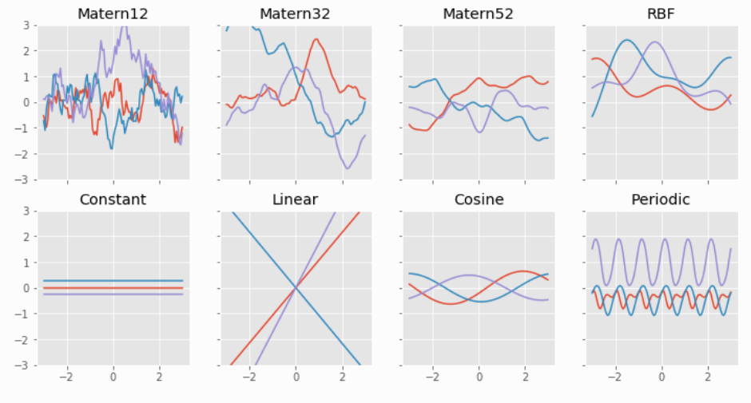

Para la optimización de parámetros se utiliza la función _gpflow.train.ScipyOptimizer_, para las variables que tienen distribución a priori se utiliza una estimación de maximo a posteriori, y para el resto se utiliza maxima verosimilitud.

## Resultados experimentales

Se llevo a cabo un proceso de validación cruzada con 5 particiones (5 fold cross validation). El dataset se encuentra desbalanceado, hay 1014 muestras que pertenecen a individuos sanos y 298 correspondientes a individuos con cancer.

El profesor nos entrego las 5 particiones ya definidas. Para tratar el problema del desbalanceo, se va a proceder de la siguiente forma:

- Datos de test: Suponiendo el fold 1, que posee 203 casos negativos y 54 positivos, estos seran los datos de test.
- Datos de entrenamiento: Para balancear las clases se tomarán las muestras positivas de los 4 folds restantes. Asimismo se tomarán todas las muestras negativas. Se entrenarán 4 modelos por separado, donde para entrenar en cada caso se utilizaran todas las muestras positivas, y las negativas se separarán en 4 conjuntos disjuntos que abarquen todas las muestras negativas de los 4 folds. 

### Resultados validación cruzada

Las curvas ROC resumen la compensación entre el ratio de verdaderos positivos y falsos positivos para un modelo predictivo utilizando diferentes thresholds (puntos de corte) de probabilidad. El eje X grafica el ratio de falsos positivos, versus el ratio de verdaderos positivos en el eje Y, para diferentes valores de threshold de la probabilidad de la clase positiva. Más concretamente el eje Y muestra la sensibilidad (TP / (TP + FN)) y el eje X 1 - especificidad ( especificidad = TN /(FP+TN)).

Las curvas de precision-recall resumen la compensación entre el ratio de verdaderos positivos y el valor predictivo positivo (TP / (TP + FP)) para un modelo predictivo utilizando diferentes thresholds (puntos de corte) de probabilidad. La precisión o valor predictivo positivo se grafica en el eje Y, y el recall o sensibilidad (TP / (TP + FN)) se grafica en el eje X. para diferentes valores de threshold de la probabilidad de la clase positiva, de forma similar a la curva ROC.

Las curvas ROC son más apropiadas cuando las observaciones se encuentran balanceadas para cada clase, mientras que las curvas precision-recall son más apropiadas para el caso de datasets no balanceados.

La figura a continuación muestra las curvas ROC para los 5 folds de cross validation utilizando el kernel RBF (izquierda), y las curvas ROC para los 5 folds de cross validation utilizando el kernel lineal (derecha). Para construir las curvas ROC se promedieran las probabilidades de asignaciones a cada clase de los 4 clasificadores entrenados por fold.

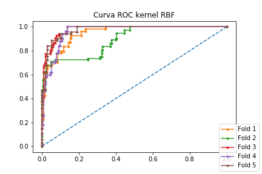
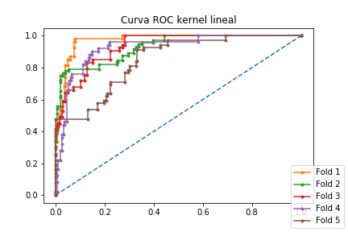

Para el caso de las curvas ROC cuando nos centramos en el kernel RBF se puede observar que los distintos folds tuvieron resultados similares, excepto el fold 2, el cual tuvo peores resultados. En el eje X, se puede observar para el fold una mayor cantidad de falsos positivos sin lograr detectar los verdaderos positivos. Luego cuando observamos la matriz de confusion (ver sección fold 2) podemos ver que esto se debe a que muchas instacias con etiqueta Healthy son clasificadas como Malign. Al comparar directamente cada fold utilizando kernel RBF vs lineal, podemos observar que el kernel RBF funciono mejor, excepto para los folds 1 y 2, visualmente podemos ver que el kernel lineal funciono mejor en esos casos, lo cual corroboramos en las tablas que indican el área bajo la curva en las secciones siguientes.

La figura a continuación muestra las curvas precision-recall para los 5 folds de validación cruzada utilizando el kernel RBF a la izquierda y kernel lineal a la derecha

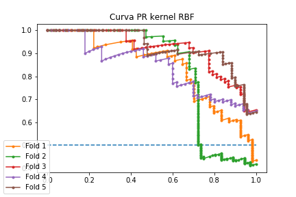
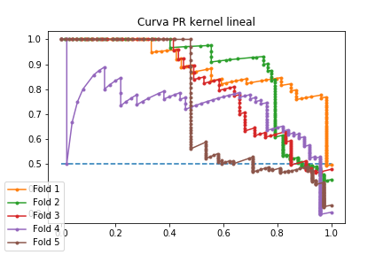

Se puede observar que visualmente podemos realizar la misma interpretación para los folds 1 y 2, el kernel lineal funciona mejor que el RBF y el kernel RBF funciona mejor para el resto de los folds.

A continuación se presentan los resultados para cada fold en particular.

#### Fold 1

**RBF Kernel**

|Métrica|Valor|
|---|---|
|AUC ROC| 0.948|
|AUC PR|0.840|
|Accuracy|0.88|
|Specificity|0.92|
|Sensitivity|0.7|
|Precision|0.7|
|F_score|0.7|

**Linear Kernel**

|Métrica|Valor|
|---|---|
|AUC ROC| 0.972|
|AUC PR|0.892|
|Accuracy|0.71|
|Specificity|0.64|
|Sensitivity|1.0|
|Precision|0.42|
|F_score|0.59|

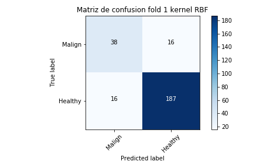
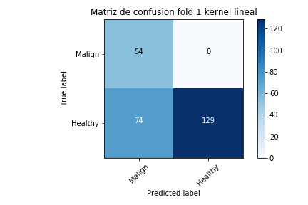

Es interesante notar para el kernel lineal, la elevada sensibilidad, dado que podemos detectar todos los verdaderos positivos, sin embargo la precision es baja, ya que detectamos muchos falsos positivos, y esto también se ve reflejado en el F-score.

#### Fold 2

**RBF Kernel**

|Métrica|Valor|
|---|---|
|AUC ROC| 0.891|
|AUC PR|0.827|
|Accuracy|0.76|
|Specificity|0.77|
|Sensitivity|0.72|
|Precision|0.51|
|F_score|0.6|

**Linear Kernel**

|Métrica|Valor|
|---|---|
|AUC ROC| 0.930|
|AUC PR|0.872|
|Accuracy|0.51|
|Specificity|0.34|
|Sensitivity|1.0|
|Precision|0.34|
|F_score|0.51|

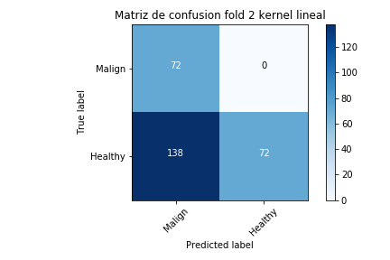

En este fold podemos observar algo similar para el kernel lineal, pero aún mas exarcebado, ya que la precision es aún menor debido a la enorme cantidad de falsos positivos que se detectan.

El accuracy para el kernel lineal es 0.51, esto es prácticamente análogo a tirar una moneda. En este caso esto se debe a que muchas instancias de clase negativa (healthy) estan siendo clasificadas como clase positiva (malign).

#### Fold 3

**RBF Kernel**

|Métrica|Valor|
|---|---|
|AUC ROC| 0.977|
|AUC PR|0.915|
|Accuracy|0.94|
|Specificity|0.98|
|Sensitivity|0.77|
|Precision|0.91|
|F_score|0.83|

**Linear Kernel**

|Métrica|Valor|
|---|---|
|AUC ROC| 0.933|
|AUC PR|0.814|
|Accuracy|0.74|
|Specificity|0.67|
|Sensitivity|1.0|
|Precision|0.44|
|F_score|0.61|

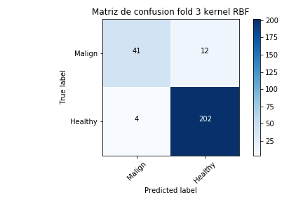

En este fold es interesante hacer notar la performance del kernel RBF el cual consigue un F-score relativamente alto, debido a la baja cantidad de falsos positivos que tiene, sin embargo se ve afectado por la cantidad de falsos negativos.

El kernel lineal nuevamente tiene un métrica de precision muy mala, debido a la gran cantidad de falsos positivos.

#### Fold 4

**RBF Kernel**

|Métrica|Valor|
|---|---|
|AUC ROC| 0.960|
|AUC PR|0.839|
|Accuracy|0.89|
|Specificity|0.9|
|Sensitivity|0.84|
|Precision|0.69|
|F_score|0.76|

**Linear Kernel**

|Métrica|Valor|
|---|---|
|AUC ROC| 0.924|
|AUC PR|0.722|
|Accuracy|0.81|
|Specificity|0.77|
|Sensitivity|0.96|
|Precision|0.52|
|F_score|0.67|

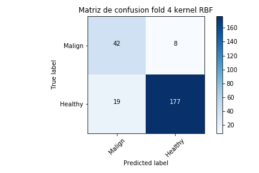

Es el primer fold en el que la sensibilidad para el kernel lineal no fue 1.

#### Fold 5

**RBF Kernel**

|Métrica|Valor|
|---|---|
|AUC ROC| 0.973|
|AUC PR|0.924|
|Accuracy|0.92|
|Specificity|0.95|
|Sensitivity|0.84|
|Precision|0.85|
|F_score|0.84|

**Linear Kernel**

|Métrica|Valor|
|---|---|
|AUC ROC| 0.850|
|AUC PR|0.733|
|Accuracy|0.71|
|Specificity|0.63|
|Sensitivity|0.93|
|Precision|0.46|
|F_score|0.62|

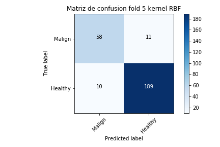
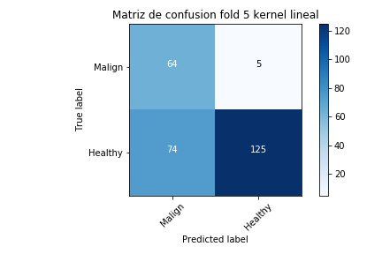

Este fold tiene un comportamiento similar al fold 3 para el kernel RBF. La precision para el kernel lineal nuevamente estuvo por debajo de 0.5

**Comentarios generales**

De forma general el kernel lineal tiene mayor sensibilidad, debido a que tiene una baja cantidad de falsos negativos, sin embargo sufre problemas de precision, ya que detecta una alta cantidad de falsos positivos.

El kernel RBF tiene un comportamiento más balanceado en el sentido de que lás métricas de área bajo la curva ROC y PR fueron mejores en más folds de cross validation que para el kernel lineal. Lo mismo sucede con el F-score que fue mejor en mas folds para el kernel RBF que el kernel lineal.

Sin embargo el kernel RBF tiene un problema muy importante con respecto a la sensibilidad, en un caso de una patología como cancer es preferible una mayor cantidad de falsos positivos que de falsos negativos. Un falso negativo indica que una persona con cancer no recibe un diagnóstico, si no recibe el diagnóstico no comenzará un tratamiento paliativo. Sin embargo un falso positivo se puede solucionar desde el punto de vista del diagnóstico, realizando más estudios biológicos para descartar dicho diagnóstico erróneo.

Es interesante la conclusión a extraer, ya que si bien las métricas puras y duras nos indican que el kernel RBF es el que mejor funciona, probablemente el método a emplear sea con un kernel lineal, de acuerdo a lo anteriormente expuesto.

### Como clasificar un nuevo dato

Centrandonos en el caso concreto de esta practica, cuando tenemos un nuevo caso (imagen), lo primero que debemos realizar es calcular el descriptor, el histograma de los rasgos obtenidos tras calcular características LBP uniformes invariantes por rotaciones con radio 1 y número de vecinos igual a 8.

Luego debemos normalizar el histograma, en este trabajo se aprendió la media y desvio de los datos de entrenamiento utilizando la función preprocessing.StandardScaler del paquete scikit-learn, por lo tanto se debería normalizar por la media y el desvio de acuerdo a los datos aprendidos del dataset de entrenamiento.

Con estos pasos obtuvimos un descriptor estandarizado de la imagen, que se puede utilizar para clasificar la misma, pero para esto necesitamos un modelo de clasificación.

**Consideraciones sobre la creación del modelo**

Suponiendo que tenemos un conjunto de datos de entrenamiento $(x_i, y_i)$, queremos encontrar una función $f$ que se ajuste de forma adecuada a los datos, es decir, $y:i$ sea aproximadamente igual a $f(x_i)$ para la mayoría de los puntos $i$. Para esto debemos definir la forma de $f$. Como la forma de $f$ es desconocida, debemos estimarla a partir de la información que tenemos, el conjunto de datos de entrenamiento.

La forma de estimar la función $f(x)$ puede ser paramétrica o no paramétrica.

En el caso de los métodos paramétricos, comenzamos con una asumpción de la forma de la función, por ejemplo, que es lineal, $f(X) = \beta_0 + \beta_1X_1 + ... + \beta_pX_p$, y debemos estimar los coeficientes $\beta_o, \beta_1, ..., \beta_p$.
Luego necesitamos una forma de optimizar los parámetros del modelo, por ejemplo en el caso de un modelo lineal, con el método de mínimos cuadrados.

En el caso de los métodos no paramétricos no realizamos asumpciones de la forma de la función. Sino que buscamos un estimado de $f$ que se ajuste a los datos de entrenamiento permitiendo una flexibilidad que no sea excesiva.

En el caso de los procesos gaussianos, podemos comenzar por construir diferentes modelos en los que cambiamos el kernel utilizado para ver cual funciona mejor sobre este problema. Para decidir cual funciona mejor podemos utilizar validación cruzada, y evaluando métricas como las vistas en este trabajo práctico. Una vez que sepamos cual kernel funciona mejor, debemos decidir el valor de corte de la probabilidad para indicar cuando estamos en presencia de un caso negativo o positivo.

Para construir el clasificador final podemos utilizar una serie de alternativas:

- Utiizar todos los datos de entrenamiento que tenemos para construir un único modelo. Este modelo sera empleado para clasificar un nuevo dato que se nos presente. Generalmente esto puede funcionar bien, pero en el caso del dataset de entrenamiento de esta práctica que se encuentra desbalanceado, esto puede dar lugar a overfitting.
- Construir modelos para cada fold de cross validation, de forma análoga a lo que realizamos en esta práctica, y luego clasificar la clase de la nueva observación de acuerdo a un voto mayoritario.
- Otra alternativa es tener diferentes modelos para diferentes folds de cross validation, y ponderar cada modelo de acuerdo a las estadísticas obtenidas en cada fold, y decidir la clase de acuerdo a un voto ponderado de cada modelo.
- También se puede considerar crear modelos utilizando diferentes párametros como kernels, nuevamente evaluarlos por validación cruzada, ponderarlos, y definir la clase por un voto ponderado.

### Diseño de experimento adicional

Para balancear las clases y aumentar el número de casos positivos:

- Lo primero que intentaría realizar es conseguir mas ejemplos de la clase positiva.
- Se pueden generar ejemplos sintéticos de la clase minoritaria, mediante el uso de una técnica de oversampling.
- Se puede agregar rotaciones a las imágenes positivas para generar más casos positivos.
- Se puede utilizar un algoritmo como SMOTE, que crea nuevas instancias de la clase minoritaria, al mismo tiempo que downsamplea la clase mayoritaria.
- Se puede agregar algun tipo de ruido a las imágenes positivas para generar mas instancias.
- Se pueden escalar las imágenes positivas (zoom in - zoom out) para generar nuevas instancias.
